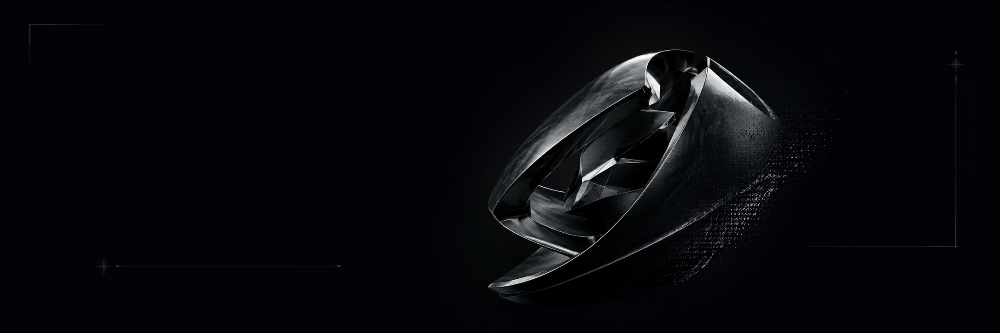

  

  <strong>Nathan</strong> — I build local-first desktop products and AI infrastructure, mostly with Rust, Tauri & TypeScript. 
  Software builder · systems engineer · product-focused developer · France

  🔭 Currently building <a href="https://github.com/VoltLaunchr/Volt">Volt</a> & <a href="https://github.com/BaseMyAI/basemyai">BaseMyAI</a> ·
  🌱 Local-first, encrypted, offline-capable systems ·
  💬 Ask me about Tauri, Rust, product design ·
  ⚡ Fast interfaces, explicit architecture

  <a href="https://github.com/VoltLaunchr/Volt">Volt</a> ·
  <a href="https://github.com/BaseMyAI/basemyai">BaseMyAI</a> ·
  <a href="https://x.com/ShipFastGo">X</a> ·
  <a href="mailto:nathan@voltlaunchr.com">Email</a>

## 01 — About

<table>
<tr>
<td width="65%" valign="top">

I'm a self-taught developer and product builder based in France.

I build complete software products — from interface and product design to native integrations, APIs, persistence, and release infrastructure. I care about fast interfaces, explicit architecture, local ownership, and software that survives real-world constraints.

Currently building **Volt**, a cross-platform desktop launcher, and **BaseMyAI**, a local-first memory engine for AI agents.

</td>
<td width="35%" valign="top" align="center">
  
</td>
</tr>
</table>

## 02 — Currently Building

**Volt** — Keyboard-first launcher for Windows, macOS and Linux. Search apps & files, run commands, clipboard history, calc, unit conversion, extensible via TypeScript plugins.

**BaseMyAI** — Private memory infrastructure for AI agents. Local-first, encrypted, temporal memory engine — durable persistence, agent isolation, local retrieval via Rust, CLI, MCP, REST and Python.

## 03 — Selected Work

| Project | What it does | Stack | Links |
|---------|--------------|-------|-------|
| **Volt** — *Everything on your computer. One shortcut.* | Open-source launcher for 3 OS. Instant search, command palette, clipboard & plugins. | `Tauri 2` `Rust` `React` `TypeScript` `SQLCipher` | [Website](https://voltlaunchr.com) · [Source](https://github.com/VoltLaunchr/Volt) |
| **BaseMyAI** — *Private memory infrastructure for AI agents.* | Temporal memory engine in Rust. Encrypted, local retrieval, isolated agents, multi-interface. | `Rust` `Tokio` `axum` `candle` `MCP` | [Website](https://basemyai.com) · [Source](https://github.com/BaseMyAI/basemyai) |

## 04 — Toolbox

**Languages:** `Rust` `TypeScript` `SQL`
 
**Frontend:** `React` `Next.js` `Tailwind CSS` `Tauri 2`
 
**Backend & Infra:** `Tokio` `axum` `Node.js` `PostgreSQL` `SQLite` `SQLCipher` `Supabase` `Drizzle` `Docker` `GitHub Actions`
 
**AI & Protocol:** `candle` `MCP`

  

## 05 — Activity

  

  
  

  <picture>
    <source media="(prefers-color-scheme: dark)" srcset="https://raw.githubusercontent.com/MikeRoss27/MikeRoss27/output/github-contribution-grid-snake-dark.svg" />
    <source media="(prefers-color-scheme: light)" srcset="https://raw.githubusercontent.com/MikeRoss27/MikeRoss27/output/github-contribution-grid-snake.svg" />
    
  </picture>

## 06 — Connect

  
  
  
  

  Building ambitious products, one release at a time.

